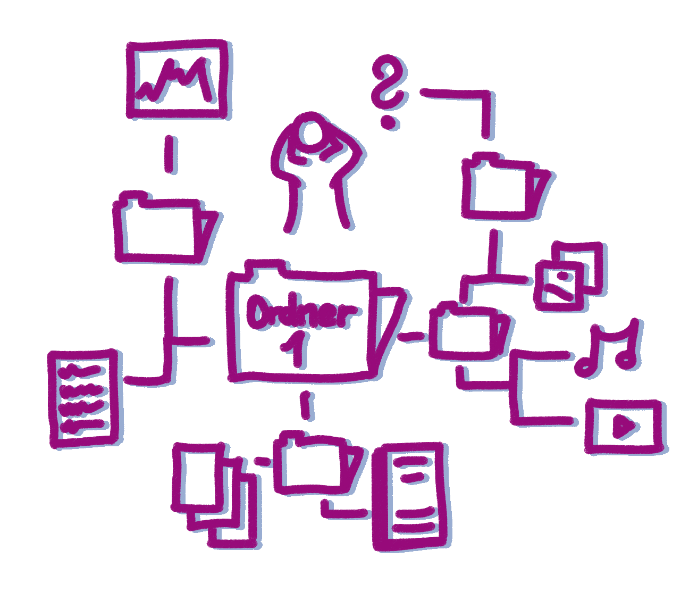

# Flyer "Kurzinfos zum Umgang mit Forschungsdaten"

Gefördert im Digitalisierungsprogram 3.0 des Landes Schleswig-Holstein

## FORSCHUNGSDATENMANAGEMENT

### FORSCHUNGSDATEN

Zu Forschungsdaten zählen alle Informationen, die in eine wissenscahftliche Arbeit eingeflossen sind, ebenso wie die Ergebnisse einer solchen Arbeit. 

## FORSCHUNGSDATENMANAGEMENT (FDM)

Unter FDM versteht man den systematischen Umgang mit Forschungsdaten während:

- Transformation
- Selektion
- Speicherung

Mit dem Ziel, die Daten:

* langfristig & personenunabhängig nachnutzbar und nachprüfbar zu halten.

### WARUM?

Forschungsdatenmanagement...

* fördert die Umsetzung ethischer Standards und Grundsätze der Guten Wissenschaftlichen Praxis
* schafft Rechtssicherheit
* verringert die Gefahr von Datenverlust
* verbessert den Datenaustausch innerhalb von Forschungsgruppen (z.B. Datenübergabe zwischen Doktorandengenerationen
* macht Daten verfügbar und nachnutzbar
* zur Bewilligung von Drittmitteln wird der Nachweis eines strukturierten Datenmanagements immer wichtiger

## DATENMANAGEMENTPLAN

Ein Datenmanagementplan (DMP) hilft, den Umgang mit den eigenen Forschungsdaten zu strukturieren. DMPs können sowohl als Checklisten dienen, als auch zur laufenden Dokumentation: von der Erhebung bis zur langfristigen Speicherung bzw. Veröffentlichung der Daten.

{{1}}
********************
__Vorteile__

* erleichtert Zusammenarbeit

* erleichtert die Dokumentation bei Bereichtspflichten 

* erelichtert die Nachnutzung der eigenen Daten

********************

{{2}}
********************
__Weiterführende Informationen unter:__

https://forschungsdaten.info/

********************

## FAIR

Die FAIR-Prinzipien bilden eine Grundlage für den Umgang mit Daten. 

🔎  _Findable_:         Ihre Forschungsdaten sind auffindbar und zitierfähig.  
 
🔐  _Accessible_: Ihre Forschungsdaten sind zugänglich. 
 
🔗  _Interoperable_: Ihre Forschungsdaten sind technisch nachnutzbar (Formate, Software).  
 
♻️  _Re-useable_: Ihre Daten sind verständlich dokumentiert und können rechtssicher wiederverwendet werden. 

## DATENPUBLIKATION

„Sharing is caring“ – dies gilt auch für Forschungsdaten. Daten sind nicht nur für die eigene Forschung wertvoll, sondern können auch nach Abschluss des Forschungsprojekts für andere Fragestellungen wichtige Impulse geben.

{{1}}
********************
__Vorteile__

* Generiert Aufmerksamkeit

* Unterstützt interdisziplinäre Forschung

* Ermöglicht Vergleichbarkeit

* Nachnutzbarkeit und Nachvollziehbarkeit
********************

## OPEN SCIENCE
Open Science zielt darauf ab, „alle Bestandteile des wissenschaftlichen Prozesses über das Internet offen zugänglich und nachnutzbar zu machen“ (Mission Statement)

{{1}}
********************
__Vorteile__

* Nachvollziehbarkeit und Reproduzierbarkeit

* Nachnutzbarkeit erhöhen

* Verbreitung verbessern
********************

### Exkurs: Open Science Community 

  
    !
  

  

  Austausch- und Vernetzungsmöglichkeiten zum Thema Open Science bietet:

  Open Science Community

  https://www.zbw.eu/de/ueber-uns/veranstaltungen/open-science-kiel
  

## METADATEN

Das Etikett auf einer Dose sagt, was drin ist. Genauso sorgen Metadaten dafür, dass digitale Daten und Objekte gefunden und genutzt werden können. Deshalb ist es wichtig, auch die eigenen Forschungsdaten mit „Etiketten“ zu versehen.

## FDM in SCHLESWIG-HOLSTEIN

Die Landesinitiative für das Forschungsdatenmanagement (FDM) Schleswig-Holstein ist eine gemeinsame Initiative der Hochschulen und Forschungseinrichtungen des Landes. Die Initiative fördert kooperative Lösungen, bietet Unterstützung, ermöglicht Austausch und trägt zur Schaffung gemeinsamer Strukturen im Umgang mit Forschungsdaten bei.

 
 

{{1}}
********************
__Informationen & Beteiligungsmöglichkeiten __

https://fdm-sh.de/

AG Kompetenzentwicklung der Landesinitiative FDM-SH  
Illustrationen: Cleo Michelsen, Esther Thelen

********************

 
 
https://creativecommons.org/licenses/by/4.0/ 

