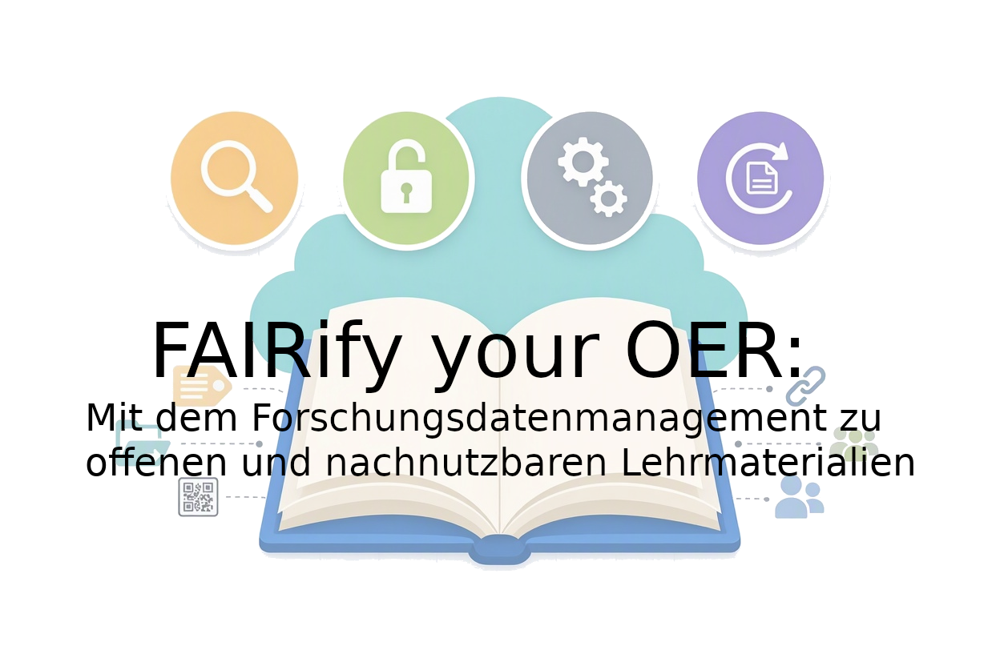
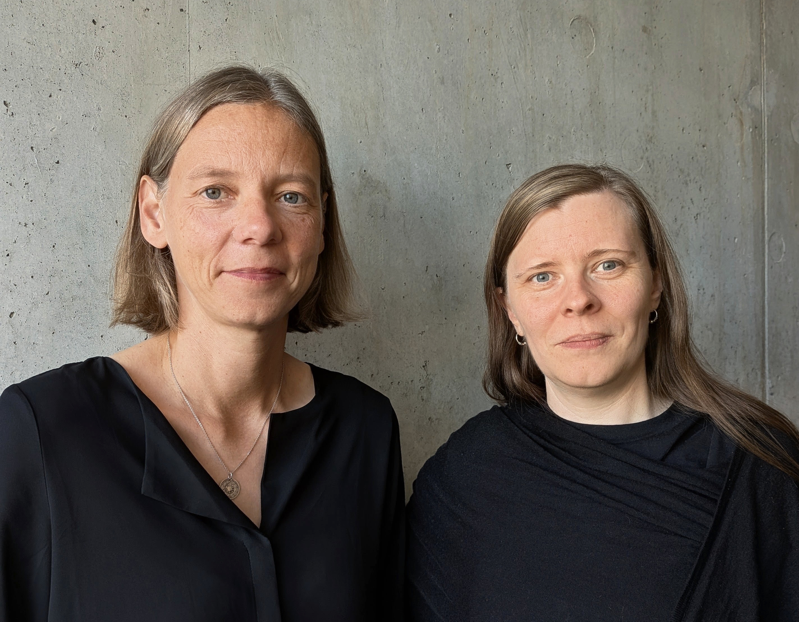
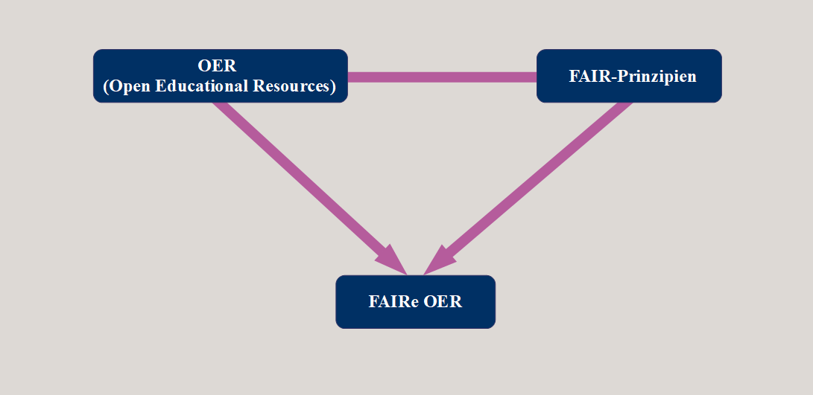
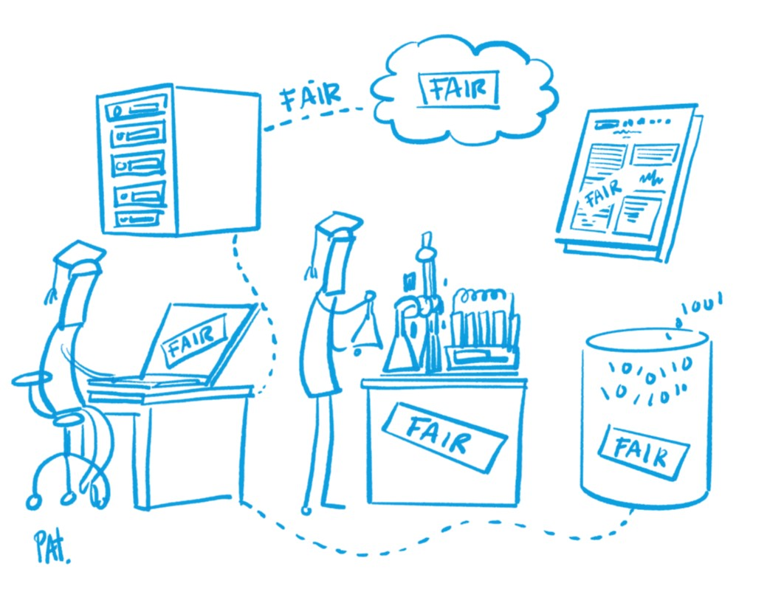
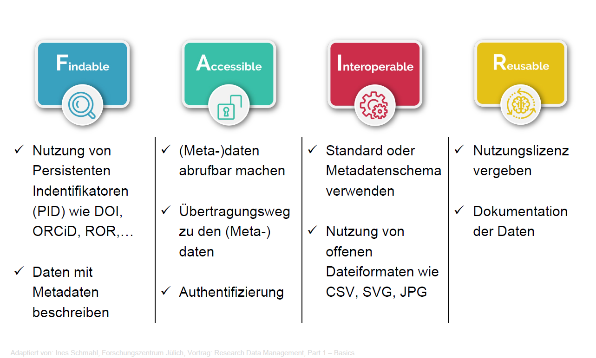
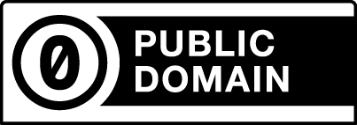
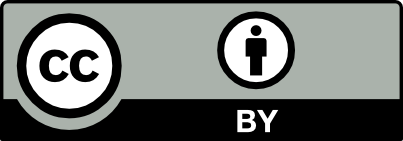
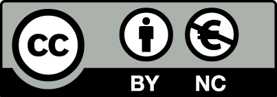
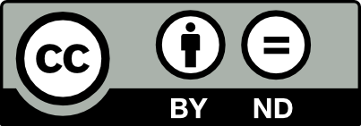
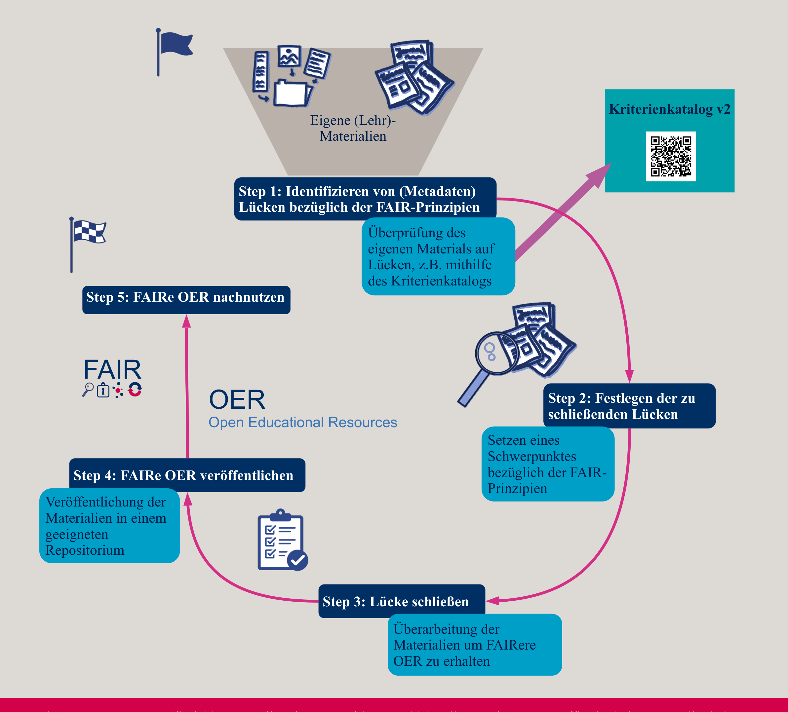

<!--

author:   Linda Zollitsch, Swantje Piotrowski

email:    zollitsch@ub.uni-kiel.de
version:  0.1.0
language: de
narrator: UK English Female

icon:     /images/logo_digiprog.png

import:   https://raw.githubusercontent.com/LiaTemplates/Fullscreen/0.0.1/README.md

link: style_css.css

licence: CC-BY 4.0

comment:   presentation for workshop: FAIRify your OER - Mit dem Forschungsdatenmanagement zu offenen und nachnutzbaren Lehrmaterialien

-->

# Workshop FAIRify your OER

-----

FAIRify your OER: Mit dem Forschungsdatenmanagement zu offenen und nachnutzbaren Lehrmaterialien
---

FDM-SH bOERse wird als Umsetzungsprojekt im Rahmen des Digitalisierungsprogramms 4.0 des Landes Schleswig-Holstein gefördert.

-----

> To see this document as an interactive LiaScript rendered version, click on the
> following link/badge:
>
> 
>
> If you have questions, please contact us: [Central Research Data Management](https://www.uni-kiel.de/de/universitaet/handlungsfelder/digitale-transformation/forschungsdatenmanagement)
>
> This work is licenced under CC-BY 4.0 (https://creativecommons.org/licenses/by/4.0/)

 

## Willkommen

 

## Wer sind wir?

Swantje Piotrowski & Linda Zollitsch

<!--style = "width: 450px;"-->

^Foto von Esther Thelen^

 

## Wer seid ihr?

-----

Aus welchem Arbeitsbereich kommt ihr?
---

Warum seid ihr hier?
---

 

## Workshopregeln

-----

- Macht auf euch aufmerksam, wenn ihr etwas sagen wollt.
- Fragt bei Unklarheiten nach.
- Hört einander zu und lasst euch ausreden.
- Helft euch gegenseitig.
- Erledigt möglichst nichts nebenbei.
- Beteiligt euch aktiv.
- Lasste Fehler zu -> positive Fehlerkultur.
- Gebt Bescheid, wenn ihr eine Pause benötigen.

 

## Agenda

---

* Theoretische Einführung

  - OER
  - FAIR-Prinzipien
  - FAIRe OER: zwei Beispiele

* Hinführung zur Anwendung: How to FAIRify your OER

  - **Step 1**
  - **Step 2**
  - Step 3
  - Step 4
  - Step 5

* Abschluss

 

## Beschreibung

---

In der Lehre ist es üblich, Materialien weiterzuverwenden und anzupassen. Damit Materialien langfristig zugänglich, nutzbar und veränderbar bleiben, kommt es darauf an, sie entsprechend zu gestalten.

---

Genau hier setzt unser Workshop an: Wir führen euch in zentrale Konzepte zu OER und FAIR ein und zeigen, wie ihr offene und nachnutz bare Lehr- und Informationsmaterialien erstellen und weiterentwickeln könnt. Gemeinsam betrachten wir konkrete Ansätze, die ihr direkt auf eure eigenen Materialien anwenden könnt.

---

 

## Limitation

- Eine praktische Umsetzung und Überarbeitung von eigenen Materialien kann im Rahmen des Workshops nicht geleistet werden.

- Wir fokussieren uns nur auf Teilaspekte der FAIR-Prinzipien und geben dafür Beispiele.

- Es ist erwünscht, eigene Beispiele in die Diskussion mit einzubringen.

 

# Theoretische Einführung

 

## Open Educational Resources (OER)

<!--style = "width: 300px;"-->

^This logo is a CC0/Public Domain OER logo which can be used and adapted freely. It is based on an original design from "leomaria", Berlin.^

 

### Was ist das?

<!---

Lernziele (LZM-FDM):

Lernende können den Begriff OER erläutern.*

--->

 

{{0-1}}
********************
offene Fragerunde:
---

- **Welche Berührungspunkte hattet ihr bisher mit OER?**

- **Was wisst ihr bereits über OER?**

********************

{{1-2}}
********************

Definition
---

"Open Educational Resources (OER) sind Bildungsmaterialien jeglicher Art und in jedem Medium, die unter einer offenen Lizenz stehen. Eine solche Lizenz ermöglicht den kostenlosen Zugang sowie die kostenlose Nutzung, Bearbeitung und Weiterverbreitung durch Dritte ohne oder mit geringfügigen Einschränkungen."
"OER sind nicht nur kostenlos zugänglich, sondern können auch frei bearbeitet, geteilt, aktualisiert und vor allem an individuelle Lernbedürfnisse und -kontexte angepasst werden."

"Open Educational Resources können einzelne Materialien, aber auch komplette Kurse oder Bücher umfassen. Jedes Medium kann verwendet werden. Lehrpläne, Kursmaterialien, Lehrbücher, Streaming-Videos, Multimedia-Anwendungen, Podcasts – all diese Ressourcen sind OER, wenn sie unter einer offenen Lizenz veröffentlicht werden. Dabei bestimmen die Urhebenden selbst, welche Nutzungsrechte sie einräumen und welche Rechte sie sich vorbehalten."

https://www.unesco.de/themen/bildung/bildungsqualitaet/weltbildungsempfehlung/global-citizenship-education/friedens-und-menschen/open-educational-resources/

********************

{{2-3}}
********************

OER umfassen
---

* Lehrbücher
* Lehrpläne
* Lehrveranstaltungskonzepte
* Skripte
* Aufgaben
* Tests
* Projekte
* Audio-, Video- und Animationsformate.

Und vieles mehr...

********************

{{3}}
****************************

OER anhand der 5V
---

| Anforderung                  | Bedeutung                                  |
| ---------------------------- | ------------------------------------------ |
| `verwahren/vervielfältigen ` | Download, Speicherung und Vervielfältigung |
| `verwenden`                  | Nutzung im Lernkontext                     |
| `verarbeiten`                | Umgestaltung und Adaption                  |
| `vermischen`                 | Kombination und Extraktion                 |
| `verbreiten`                 | (digitale) Publikation                     |

*_5 V-Freiheiten für Offenheit_ von Jöran Muuß-Merholz und Jörg Lohrer für [open-educational-ressources](https://open-educational-resources.de) - Transferstelle für OER*

_OER können der Auslöser für Innovation und neue Lenrformen des 21. Jahrhunderts sein._

-- _Handreichung OER - Der Einstieg in den Umgang mit Open Educational Ressources_, Bericht des Projektes OERsax, 2018

*******************************

### Kritik am OER-Ansatz

 

Welche Probleme seht ihr im OER-Ansatz?
---

-----

{{1}}
********************

| Ebene                               | Kernaussage                                                                             |
| ----------------------------------- | --------------------------------------------------------------------------------------- |
| Emotionale Einordnung               | "_Da kann ja jeder meine Arbeit für sich nutzen!_"                                      |
|                                     | "_Da kann mich ja jeder kontrollieren!_"                                                |
| Rechtliche Herausforderungen        | "_Ich verwende viele Grafiken, bei deren Urheberrecht ich mir im besten Fall unsicher bin!_"                                                                                        |
| Auffindbarkeit                      | "_Ich finde keine Inhalte, die ich in meiner Lehre gewinnbringend integrieren kann!_"   |
| <!-- Style="color:red" --> Aufwand  | <!-- Style="color:red" --> "_Da muss man ja Informatik studiert haben!_"                |
| <!-- Style="color:red" -->Abdeckung | <!-- Style="color:red" -->"_Da fehlen mir aber die Schnittstellen für meine Tools XY!_" |

********************

### OER in a nutshell

 

OER bezeichnen Bildungsmaterialien mit folgenden Eigenschaften:
---

  - Zugänglichkeit    
  - offene Lizenz
  - kostenlose Nutzung
  - Bearbeitung und Weiterverbreitung (mit geringfügigen Einschränkungen) erlaubt

-----

## FAIR-Prinzipien

-----

Wofür steht FAIR?
---
<!--style = "width: 100px;"-->

 

### Was ist das?

 

{{0-1}}
****************
 

Ein wichtiges Ziel des strukturierten Foschungsdatenmanagements ist es, Daten langfristig und personenunabhängig zugänglich, nachnutzbar und nachprüfbar zu halten.

Die [**FAIR-Prinzpien**](https://www.nature.com/articles/sdata201618) dienen als Leitfaden für die Auswahl von Handlungsoptionen, die sicherstellen sollen, dass die im Rahmen von Forschung geschaffenen digitalen Artefakte auffindbar, zugänglich, interoperabel und wiederverwendbar sind.

<small>Illustration: Patrick Hochstenbach in Engelhardt, Claudia et. al. (2021).</small>

****************

{{1}}
>**F**indable

{{2-3}}
****************
Der erste Schritt bei der (Wieder-)Verwendung von Daten besteht darin, sie zu finden. Metadaten und Daten sollten sowohl für Menschen als auch für Computer leicht zu finden sein.

- Auffindbarkeit für Menschen und Maschinen
- Metadaten maschinenlesbar
- Vergabe eines persistenten Identifikators für (Meta-) Daten

***************

{{1}}
>**A**ccessible

{{3-4}}
***********************
Sobald der Nutzer die gewünschten Daten gefunden hat, muss er wissen, wie er auf sie zugreifen kann, möglicherweise einschließlich Authentifizierung und Autorisierung.

- Verfügbarkeit von Daten und Metadaten für Menschen und Maschinen
- über Standard-Kommunikationsprotokolle (z.B. https)
- Metadaten verfügbar machen, auch wenn die Daten selbst nicht direkt zur Verfügung stehen

******************

{{1}}
>**I**nteroperable

{{4-5}}
**********************
Daten sollten in einer Form vorliegen, die die Nutzung mit diversen Anwendungen oder Arbeitsabläufen für die Analyse, Speicherung und Verarbeitung ermöglichen.

- Verknüpfungsmöglichkeiten verschiedener Datensätze ermöglichen
- Nutzung von Ontologien, Thesauri sowie maschinenlesbare Formate (z.B. XML)
- Verknüpfung von Datensätzen mit persistenten Identifikatoren und durch Verweise

**********************

{{1}}
>**R**eusable

{{5-6}}
***************
Das Ziel von FAIR ist es, die Wiederverwendung von Daten zu optimieren. Um dies zu erreichen, sollten Metadaten und Daten gut dokumentiert und beschrieben sowie mit einer eindeutigen Angabe bzgl. der Nutzungsbedingungen (Lizenzen) versehen sein.

- Entstehung von Daten dokumentieren (z.B. Methoden und Geräte)
- Zitieren durch persistente Identifikatoren wie DOIs
- Lizensierung, um die Bedingungen für die Nachnutzung eindeutig zu kennzeichnen

**************

### FAIR-Prinzipien in a nutshell

 

^Lehmann, Sebastian B. C.; Altemeier, Franziska; Nina, Düvel, 2026, Nachhaltige Wissenschaft mit Forschungsdatenmanagement - Eine Einführung für Betreuende von Qualifizierungsarbeiten, doi.org/10.25625/EKEEFB, GRO.data, V2^

 

#### Exkurs: Was sind eigentlich Metadaten?

{{1}}
***************
Metdata sind...

- Daten über Daten

- Administrative Daten

   - Informationen zur Verwaltung der Daten
   - Meist allgemeiner Natur

- fachspezifische Daten

  - Einzelne Aspekte oder Datensätze im Detail
  - Strukturiert nach Forschungsdisziplin

- Allgemeine Standards

  - [DataCite-Metadatenschema](https://schema.datacite.org/)
  - [Dublin Core Metadata Initiative](https://dublincore.org/)

- Fachspezifische Standards

  - [Verzeichnis der Metadatenstandards](https://rdamsc.bath.ac.uk/)

***************

 

## FAIRe OER: zwei Beispiele

{{1-2}}
**********************
- Findable

- Accessible

- Interoperable

- Reusable

**********************

{{2}}
**********************
- Findable

- Accessible

- **Interoperable**

- **Reusable**

**********************

 

### Am Beispiel des "I": Dateiformate 

{{0-2}}
***
Nicht alle Dateiformate sind für die Langzeitarchivierung und Datenaustausch geeignet.
---

***

{{1-2}}
***
Sammelt Dateiformate, mit denen ihr aktuell Materialien erstellt.

https://answergarden.ch/5231834

***

{{2-3}}
***
<iframe src="https://answergarden.ch/5231834" style="width:100%; height:600px; border: none;"></iframe>

***

 

#### Empfohlene Dateiformate für Forschungsdaten

| Datenformat | Empfohlen | in besonderen Fällen | nicht empfohlen |
| ----------- | -------- | -------- | -------- |
| Tabellen    | csv, tsv   | xlsx, spss portable    | xls, spss    |
| Text        | txt, html, rtf, odt    | docx, pdf/a   | doc, pdf   |
| Multimedia  | mpeg4, mkv  |    | quicktime, flash  | 
| Abbildungen | tiff, jpeg2000, png  |     | gif, jpeg  |  

 

### Am Beispiel des "R": Lizenzen

{{1-2}}
**************************

Welche Lizenzen oder Lizenzsysteme kennt ihr?
---

<!--style = "width: 100px;"-->

**************************

{{2-3}}
**************************

Zielscheibe: Lizenzen
---

  <iframe
    src="https://oncoo.de/lemm"
    style="width:100%; height:100%; border:none;"
    title="ONCOO Zielscheibe">
  </iframe>

**************************

{{3}}
**************************

Ergebnisse
---

  <iframe
    src="https://www.oncoo.de/t/lemm"
    style="width:100%; height:100%; border:none;"
    title="Ergebnisse der ONCOO Zielscheibe">
  </iframe>

**************************

 

 

### Was sind Lizenzen und warum brauchen wir diese?

{{0-2}}
********************
Lizenzen helfen dabei, einschätzen zu können, ob und in welcher Form Datensätze und sonstige Materialien nachgenutzt werden dürfen.

********************

{{1-2}}
********************
"Eine offene Lizenz respektiert die geistigen Eigentumsrechte des Inhabers der Urheberrechte und gewährt der Öffentlichkeit das Recht auf Zugang, Weiterverwendung, Nutzung zu beliebigen Zwecken, Bearbeitung und Weiterverbreitung von Bildungsmaterialien."
(https://www.oer-strategie.de/wp-content/uploads/691288_OER-Strategie.pdf)

- damit können die Bedingungen sichtbar gemacht werden, unter denen das Material nachgenutzt werden kann

- es herrscht Klarheit und Eindeutigkeit (Rechtssicherheit) bezüglich der Nachnutzbarkeit

********************

{{2}}
********************
Durch freie Lizenzen wird die Nutzung eines urheberrechtlich geschützten Inhalts Nachnutzenden erlaubt. Dabei können Einschränkungen in Hinblick auf den die Verbreitung von Bearbeitungen und Veränderungen oder in Bezug auf die Modalitäten einer weiteren Veröffentlichung bestehen.

Die am häufigsten verwendeten Lizenzensysteme sind:

- Creative Commons (CC) / für Texte, Abbildungen und Daten geeignet
- GNU General Public License (GPL) / für Software konzipiert
- Open Data Commons (ODC) / für Datenbanken konzipiert
- Community Data License Agreement / für Daten konzipiert

Das hierunter bekannteste Lizenzsystem sind die [Creative Commons Lizenzen](https://de.creativecommons.net/was-ist-cc/):

---

Weitere Informationen auf forschungsdaten.info: https://forschungsdaten.info/themen/rechte-und-pflichten/forschungsdaten-veroeffentlichen/creative-commons-lizenzen/

********************

 

#### Was für CC-Lizenzen gibt es?

{{1-2}}
********************

| Icon | Kürzel | Name | Erläuterung |
| -------- | -------- | -------- | -------- |
| <!--style = "width: 100px;"-->   | 0   | public domain    | Das Werk kann frei genutzt werden    |
| <!--style = "width: 100px;"--> | BY  | Namensnennung    | Der Name des Urhebers muss genannt werden   |
| <!--style = "width: 100px;"--> | BY-SA  | Weitergabe unter gleichen Bedingungen (**S**hare **A**like)  | Das Werk muss nach Veränderungen unter der gleichen Lizenz weitergegeben werden  | 
| <!--style = "width: 100px;"-->| BY-NC  | Nicht kommerziell (**N**on-**C**ommercial)   |Das Werk darf nicht für kommerzielle Zwecke verwendet werden  |  
| <!--style = "width: 100px;"--> | BY-ND  | Keine Bearbeitung (**N**o **D**erivatives)  |Das Werk darf nicht verändert werden  | 

********************

{{2}}
********************

**offene Lizenzen:**

CC0

CC-BY

CC-BY-SA

-----

**alle weiteren CC-Lizenzen gelten nicht als offene Lizenzen!**

CC-BY-SA-NC

CC-BY-ND

********************

 

### Lizenzen in a nutshell

- mehr Sicherheit bei der Nachnutzung von 'fremden' Materialien
- Klarheit in Hinblick auf eine Nutzung von Materialien
- eigene Materialien durch eine Lizenz kennzeichnen...

  - für die eigene Nachnutzung
  - für die Nachnutzung durch Andere

❗️ **Wenn keine Lizenz angegeben ist, gilt das Urheberrecht** ❗️

 

# Hinführung zur Anwendung: How to FAIRify your OER

 

## Step 1: Identifizieren von (Metadaten) Lücken bezüglich der FAIR-Prinzipien

Eigene, bereits produzierte Materialien (oder sogar bereits veröffentlichte Materialien) überprüfen auf Lücken bezüglich der FAIR-Prinzipien.

{{1-2}}
********************
Geeignete Hilfsmittel:

- **Metadatenschemata, zum Beispiel:**

  - RDA Recommendations for a minimal metadata set (Hoebelheinrich, N. J., Biernacka, K., Brazas, M., Castro, L. J., Fiore, N., Hellström, M., Lazzeri, E., Leenarts, E., Martinez Lavanchy, P. M., Newbold, E., Nurnberger, A., Plomp, E., Vaira, L., van Gelder, C. W. G., & Whyte, A. (2022). Recommendations for a minimal metadata set to aid harmonised discovery of learning resources (1.0). Zenodo. https://doi.org/10.15497/RDA00073)

  - Metadatenschema für Schulungsmaterialien (Biernacka, K., Haase, C., Löhde, B., Murcia Serra, J., Neumann, J., Scherreiks, P., Schneemann, C., Schranzhofer, H., Senft, M., Voigt, A., & Wiljes, C. (2025). Metadatenschema für Schulungsmaterialien zum Thema Forschungsdatenmanagement. Zenodo. https://doi.org/10.5281/zenodo.14800610)

---

- FAIR-Prinzipien (Wilkinson, M., Dumontier, M., Aalbersberg, I. et al. The FAIR Guiding Principles for scientific data management and stewardship. Sci Data 3, 160018 (2016). https://doi.org/10.1038/sdata.2016.18)

********************

 

### Metadaten und Metadatenlücken: Übung

-----

Zeit für die Aufgabe: 25-30 Minuten

-----

Schaut euch die eigenen Lehrmaterialien einmal genauer an und findet heraus, welche Metadaten ihr bereits hinterlegt habt sowie die Lücken, die eure Materialien möglicherweise noch enthalten. Nutzt dafür das Arbeitsblatt "uebung1.md" bzw "uebung1.odt" als Grundlage. 

Füllt dieses als Dokumentationsdatei aus, sodass ihr alle relevanten (Meta)Daten zu euren Lehrmaterialien in einer Datei habt. 

-----

Beantwortet für euch selbst die folgenden Fragen:

- Welche Lücken finden sich in den Materialien anhand der Dokumentationsdatei?

- Welche Metadaten habt ihr hinterlegt, die nicht in der Dokumentationsdatei angefragt werden? 

- Lässt sich ein Schwerpunkt der Lücken in Bezug auf die FAIR-Prinzipien feststellen? 

-----

Kommt wieder als Gruppe zusammen und teilt eure Ergebnisse mit.

-----

 

## Step 2: Festlegen der zu schließende(n) Lücke(n)

Die FAIR-Prinzipien in ihrer Gesamtheit vollständig umzusetzen ist ein Prozess, der sehr komplex ist und in einigen Fällen möglicherweise auch nie ganz erfüllt werden kann. Es empfiehlt sich daher, zunächst einen Schwerpunkt zu setzen, welchen oder welche Aspekt(e) vorrangig umgesetzt werden sollen.

- Findable (zum Beispiel über einen persistenten Identifier)

- Accessible (zum Beispiel durch Metadaten und Dokumentation des Zugangsweges)

- Interoperable (zum Beispiel durch ein offenes, nicht-proprietäres Dateiformat, in dem das Material vorliegt)

- Reusable (Wiederverwendung durch Lizenzierung für die Veröffentlichung)

-----

 

### Übung 2: Schwerpunkt setzen

-----

Zeit für die Aufgabe: 20 Minuten

-----

Nehmt eure Dokumentationsdatei erneut zur Hand und schauen schaut euch die Lücken in den Metataden an - falls ihr keine Lücken in den Metadaten habt, nutzt ein kontextbezogenes / fachspezifisches Metadatenschema und prüfte anhand dessen, welche Metadaten eure Materialien noch besser machen können.

-----

Setzt euch zu zweit zusammen und besprecht miteinander die Lücken, die ihr identifiziert habt und legt  einen Schwerpunkt fest, den ihr als ersten Punkt angehen möchtet.

Nutzt dabei folgende Leitfragen:

- Welche Aspekte der FAIR-Prinzipien sind bereits in den Materialien durch die Metadaten abgedeckt? 

- Welche Aspekte sind noch unterrepräsentiert?

- Gibt es auf Basis anderer Metadatenschemata möglicherweise noch Lücken, die geschlossen werden können?

-----

Notiert euch den Schwerpunkt, mit dem ihr beginnen wollt, ihn zu schließen. 

-----

Kommt wieder als Gruppe zusammen und teilt eure Ergebnisse mit.

-----

 

## Step 3: Lücke schließen

Nachdem Lücken in den Metadaten identifiziert wurden und festgelegt wurde, welche davon geschlossen werden sollen, geht es an die Umsetzung. 

{{1}}
********************
Beispiele:

zu Findable: Veröffentlichung der Materialien nicht eingebunden auf einer Homepage, sondern über ein Respositorium und mit einem digital object identifier (DOI). Eine Empfehlung für ein nicht disziplinspezifisches Repositorium wäre Zenodo.

zu Accessible: Es sollte auf eine möglichst umfassende Beschreibung durch Metadaten geachtet werden (z. B. Zielgruppe, Lernziele, Kontext und Version), sodass andere Nutzende die Inhalte verstehen und sinnvoll weiterverwenden können; Insbesondere aber Beschreibung des Wegs, um Zugang zu dem Material zu bekommen.

zu Interoperable: Bei Veröffentlichung des Materials ein Dateiformat wählen, das möglichst offen und nicht proprietär ist. Falls das nicht möglich sein sollte, unter den proprietären Formaten eines wählen, das dennoch auch von anderen Programmen geöffnet werden kann. Eine Empfehlung wären .md, .odt, .csv

zu Reusable: Bei Veröffentlichung des Materials eine entsprechende Lizenz mit angeben, die es den Nachnutzenden leicht macht zu erfahren, wie das Material nachgenutzt werden darf. Mögliche Lizenzen wären hier die CC-0 sowie die CC-BY Lizenzen.

********************

 

### Übung 3: Material und Metadaten überarbeiten

-----

Zeit für die Aufgabe: 30-60 Minuten (Hausaufgabe)

-----

Nehmt euer Material zur Hand und beginnt damit, es nach dem festgelegten Schwerpunkt zu überarbeiten.

Falls ihr dabei Unterstützung oder Hilfestellungen benötigt, fragt uns gern.

-----

{{1}}
********************

Beispiel 1 (Interoperable): 
- https://zenodo.org/records/4441310 (pdf-Lernkarte)
- Umwandlung der Inhalte in eine .md-Form: https://liascript.github.io/course/?https://raw.githubusercontent.com/LindaZollitsch/bOERse/main/P2I_M5.md#1

Beispiel 2 (Interoperable):
- https://zenodo.org/records/14198103
- Umwandlung der Inhalte in eine .md-Form: https://liascript.github.io/course/?https://raw.githubusercontent.com/LindaZollitsch/bOERse/main/flyer_kontor.md#1

********************

 

## Step 4: FAIRe OER veröffentlichen

Teilt eure Materialien mit anderen! (Hausaufgabe)

---

Nutzt dafür eine geeignete Plattform.

---

{{1}}
********************

Sammlungen von OER Plattformen bzw. OER-Plattformen gibt es unter den nachfolgenden Links:

https://www.uni-flensburg.de/fabricadigitalis/sammlungen/oer-meta-sammlung

https://open-educational-resources.de/materialien/oer-verzeichnisse-und-services/

https://www.bildungsserver.de/bildungswesen-allgemein/open-educational-resources-oer-12718-de.html

https://www.twillo.de/

********************

 

## Step 5: FAIRe OER nachnutzen

Nutzt die eigenen aber auch die Materialien von anderen nach!
---

 

# Abschluss

 

## Reflexion und Feedback

---

- Was lief gut?

- Wo gab es Herausforderungen?

- Wie war es allgemein?

 

## Informationen und Kontakte

{{1-2}}
********************

**FDM.SH – Landesinitiative zum Forschungsdatenmanagement in Schleswig-Holstein**
  
  https://fdm-sh.de/
  
  Kontakt: [info@fdm-sh.de](mailto:info@fdm-sh.de)

********************

{{2-3}}
********************

- **Wo gibt es die Materialien?**
  
  Die Workshopmaterialien werden als offene und nachnutzbare Materialien über **FDM-SH bOERse** bereitgestellt.
  
  Veröffentlichung und dauerhafte Verfügbarkeit über **Zenodo**.

********************

{{3}}
********************

**Fragen zum Workshop und zu FDM-SH bOERse**

  **Linda Zollitsch**

  Zentrales Forschungsdatenmanagement

  Universitätsbibliothek Kiel

  https://www.ub.uni-kiel.de

  Kontakt: [zollitsch@ub.uni-kiel.de](mailto:zollitsch@ub.uni-kiel.de)
  
---

  **Dr. Swantje Piotrowski**

  Wiss. Mitarbeiterin Digital Humanities

  Historisches Seminar der CAU

  https://www.histsem.uni-kiel.de/de/das-institut-1/abteilungen/kompetenzteam-forschendes-lernen/copy_of_swantje-piotrowski

  
  Kontakt: [s.piotrowski@email.uni-kiel.de](mailto:s.piotrowski@email.uni-kiel.de)

---

FDM-SH bOERse wird als Umsetzungsprojekt im Rahmen des Digitalisierungsprogramms 4.0 des Landes Schleswig-Holstein gefördert.

********************

 

## Weiterführende Informationen

https://www.oer-strategie.de/

https://open-educational-resources.de/

https://unesdoc.unesco.org/ark:/48223/pf0000392271.locale=en

https://www.unesco.de/dokumente-und-hintergruende/publikationen/detail/was-sind-open-educational-resources/

https://www.publisso.de/forschungsdatenmanagement/fair-prinzipien

https://forschungsdaten.info/themen/rechte-und-pflichten/forschungsdaten-veroeffentlichen/creative-commons-lizenzen/

---

RDA Recommendations for a minimal metadata set (Hoebelheinrich, N. J., Biernacka, K., Brazas, M., Castro, L. J., Fiore, N., Hellström, M., Lazzeri, E., Leenarts, E., Martinez Lavanchy, P. M., Newbold, E., Nurnberger, A., Plomp, E., Vaira, L., van Gelder, C. W. G., & Whyte, A. (2022). Recommendations for a minimal metadata set to aid harmonised discovery of learning resources (1.0). Zenodo. https://doi.org/10.15497/RDA00073)

Metadatenschema für Schulungsmaterialien (Biernacka, K., Haase, C., Löhde, B., Murcia Serra, J., Neumann, J., Scherreiks, P., Schneemann, C., Schranzhofer, H., Senft, M., Voigt, A., & Wiljes, C. (2025). Metadatenschema für Schulungsmaterialien zum Thema Forschungsdatenmanagement. Zenodo. https://doi.org/10.5281/zenodo.14800610)

FAIR-Prinzipien (Wilkinson, M., Dumontier, M., Aalbersberg, I. et al. The FAIR Guiding Principles for scientific data management and stewardship. Sci Data 3, 160018 (2016). https://doi.org/10.1038/sdata.2016.18)
 
Lehmann, Sebastian B. C.; Altemeier, Franziska; Nina, Düvel, 2026, Nachhaltige Wissenschaft mit Forschungsdatenmanagement - Eine Einführung für Betreuende von Qualifizierungsarbeiten, doi.org/10.25625/EKEEFB, GRO.data, V2

Zollitsch, L., & Piotrowski, S. (2026). Kriterienkatalog für Materialien aus dem Themenbereich Forschungsdatenmanagement (2.0). Zenodo. https://doi.org/10.5281/zenodo.18537803

 

